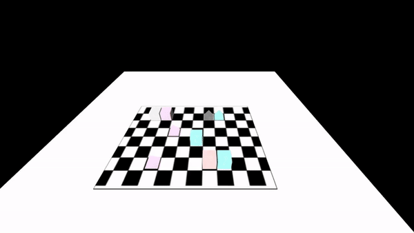
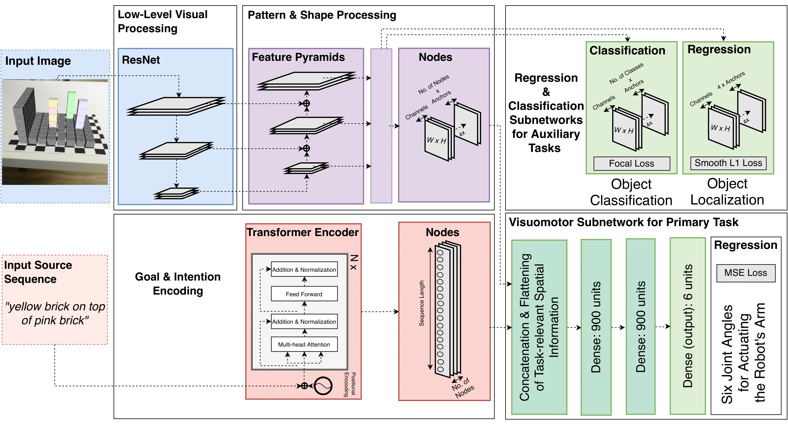

# Robot Grasping 3D

This is the codebase for the article ["Enhancing a Neurocognitive Shared Visuomotor Model for Object Identification, 
Localization, and Grasping With Learning From Auxiliary Tasks"](COMING SOON) published in the IEEE Transactions on Cognitive and 
Developmental Systems (TCDS), 2020.

If you use this code or the dataset, please cite the following:

```
article{kerzelabawi20enhancinggrasping,
title={Enhancing a Neurocognitive Shared Visuomotor Model for Object Identification, 
        Localization, and Grasping With Learning From Auxiliary Tasks},
author={Kerzel, Matthias and Abawi, Fares and Eppe, Manfred and Wermter, Stefan},
journal={IEEE Transactions on Cognitive and Developmental Systems},
year={2020},
publisher={IEEE},
}
```




In this repository, we provide the neural model used for performing a 3D robotic grasping task 
using the [NICO robot](https://www.inf.uni-hamburg.de/en/inst/ab/wtm/research/neurobotics/nico.html). We design an end-to-end neural network based on the Retinanet and Transformer architectures.
For the purpose of this study we created a new dataset based on the [Extended Train Robots](http://archive.researchdata.leeds.ac.uk/id/eprint/37) dataset, with images created
in an augmented reality environment and motor joint coordinates generated using the robotic simulation environment
[MuJoCo](http://www.mujoco.org/).


## Setup

Ensure that the environment variables necessary for this project are correctly set (run `env_vars.sh` in the [scripts](scripts) directory). 
**Always navigate to the bash script's directory before running it.**
Before running the `env_vars.sh` it is important to set `$DS_PATH` to your dataset directory path.

The dataset can be downloaded [directly](https://www.kaggle.com/fabawi/augmented-extended-train-robots) or by running `dataset_download.sh` in the [scripts](scripts) directory.
On download completion, the vision dataset is postprocessed by running a python script within `$DS_PATH/VisionMultimodalCSV/virtual/Annotations` which creates 
a new directory within `virtual`. Make sure that you have `write` privileges for the `$DS_PATH` directory, following the modification of `env_vars.sh` and the dataset download.

We recommend installing the model using the [Docker](docker) installation pipeline. Installing the 
necessary requirements can be done by running `setup_experiment_requirements.sh` in the [scripts](scripts)
directory.

### Requirements

* CUDA 9
* Tensorflow 1.2
* Keras 2.2.4

## Training

We provide multiple training examples in the [scripts/experiments](scripts/experiments) directory.
The training scripts are integrated with [comet-ml](https:comet.ml) for realtime visualization and recording experiments. 
Simply create an account on comet-ml and replace `COMET_API_KEY` and `COMET_WORKSPACE` with your credentials in `env_vars.sh`. You 
can then `source env_vars.sh` and run one of the experiments in [scripts/experiments](scripts/experiments). The results should be 
immediately visible on your online dashboard.

### Coming soon

We will provide the [paper-specific](COMING SOON) configurations in the [scripts/experiments](scripts/experiments) directory shortly.
These scripts would run the following model:




Contact [us](mailto:abawi@informatik.uni-hamburg.de) for more information on the dataset generation and 
simulation environment + scripts *(code snippets could be provided on request)*.


